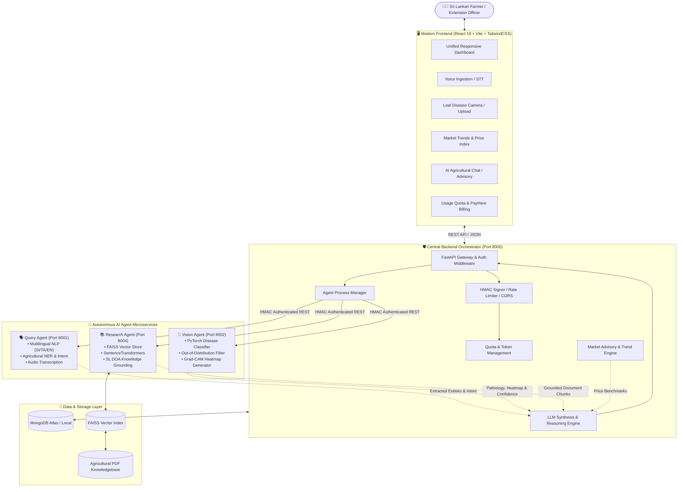

# 🌾 AgriKetha AI — Intelligent Multi-Agent Agricultural Ecosystem

[](https://fastapi.tiangolo.com/)
[](https://www.python.org/)
[](https://pytorch.org/)
[](https://react.dev/)
[](https://vitejs.dev/)
[](https://www.mongodb.com/)
[](https://github.com/facebookresearch/faiss)
[](https://tailwindcss.com/)

---

## 📌 Executive Summary

**AgriKetha AI** is an advanced, distributed multi-agent artificial intelligence platform purpose-built for Sri Lankan agriculture. By combining localized multilingual natural language processing, computer vision-based pathology diagnostics with explainability (Grad-CAM), domain-grounded Retrieval-Augmented Generation (RAG), and dynamic market intelligence, AgriKetha AI empowers smallholder farmers and agricultural extension officers with actionable, real-time agronomic advisory.

The system orchestrates autonomous micro-agents through a secure, high-throughput backend orchestrator, delivering a seamless experience across voice, image, and text modalities in Sinhala, Tamil, and English.

---

## 👥 Team & Module Leadership

| Team Member | Role & Module | Primary Technical Responsibilities |
| :--- | :--- | :--- |
| **Savin Udana** | **Query Agent & Multilingual NLP / Voice Lead** | • Multilingual NLP engine (Sinhala, Tamil, Singlish, English)<br>• Agricultural Named Entity Recognition (NER) & Intent Extraction<br>• Voice-to-Text (STT) query ingestion and dialect normalization<br>• Query preprocessing and agent routing schemas |
| **Visna Sithmi** | **Vision Agent & Deep Learning Diagnostics Lead** | • Deep learning ensemble for crop leaf disease classification<br>• Out-of-Distribution (OOD) leaf & background sanity filtering<br>• Explainable AI (XAI) with PyTorch Grad-CAM visual heatmaps<br>• Severity assessment, confidence grading, and treatment pipelines |
| **Devindi** | **Research Agent & Vector Knowledge RAG Lead** | • Domain-specific Knowledge Base ingestion (SL Dept. of Agriculture data)<br>• FAISS vector indexing & dense semantic embeddings (`sentence-transformers`)<br>• Retrieval-Augmented Generation (RAG) grounding & hallucination mitigation<br>• Multi-document chunking, context ranking, and evidence attribution |
| **Dinali** | **Backend Orchestrator & Market Advisory Lead** | • FastAPI Central Orchestrator & asynchronous multi-agent coordination<br>• Real-time Market Price Advisory engine (HARTI / market trends)<br>• System security, HMAC inter-agent authentication, rate limiting & CORS<br>• Tiered quota management, token governance, and PayHere checkout integration |

---

## 🏗️ System Architecture

AgriKetha AI is architected as an asynchronous, service-oriented multi-agent ecosystem. A centralized orchestrator receives farmer requests, securely dispatches payloads to specialized AI microservices, fuses multimodal outputs, and formats contextual responses with citations and actionable recommendations.



---

## 🤖 Detailed AI Agent Modules

### 1. 🗣️ Query Agent (`Port 8001`) — Lead: *Savin Udana*
* **Multilingual NLP Engine**: Accurately processes trilingual text inputs (Sinhala, Tamil, English) as well as phonetic Romanized Sinhala ("Singlish").
* **Voice Ingestion**: Integrated Speech-to-Text (STT) pipeline to transcribe spoken voice queries from rural farmers.
* **Agricultural NER**: Identifies crop names, symptoms, locations, soil terms, and growth stages using specialized entity extraction.
* **Intent Classification**: Classifies queries into Disease Diagnosis, Pest Control, Fertilizer/Nutrient Management, Market Inquiries, or General Agronomic Advice.

### 2. 🍃 Vision Agent (`Port 8002`) — Lead: *Visna Sithmi*
* **Deep Learning Disease Classifier**: Neural network ensemble trained on crop pathology datasets for Paddy, Tea, Coconut, Rubber, Tomato, Pepper, and local vegetables.
* **OOD (Out-of-Distribution) Verification**: Detects non-leaf images, blurry inputs, or irrelevant photos before inference to prevent erroneous predictions.
* **Explainable AI (Grad-CAM)**: Generates visual saliency heatmaps overlaid on the uploaded leaf image, showing the exact lesion regions that informed the AI's diagnosis.
* **Severity & Treatment Mapping**: Computes disease stage (Early, Moderate, Severe) and matches direct chemical/organic intervention strategies.

### 3. 📚 Research Agent (`Port 8004`) — Lead: *Devindi*
* **Domain Knowledge Base**: Ingests official agricultural manuals, extension leaflets, circulars, and diagnostic guidelines from the Sri Lanka Department of Agriculture (DOA) and research institutes (CRI, TRI, RRI).
* **FAISS Vector Index**: Dense vector embeddings generated via `sentence-transformers` for millisecond-scale semantic similarity search.
* **RAG Pipeline**: Retrieves top-k relevant context chunks with source citations, ensuring AI responses are verified, factual, and free from hallucinations.
* **Dynamic Crop Filtering**: Isolates search vectors strictly to the relevant crop type for high-precision retrieval.

### 4. ⚙️ Central Backend & Market Advisory (`Port 8000`) — Lead: *Dinali*
* **Multi-Agent Orchestrator**: Coordinates synchronous and asynchronous pipelines across Query, Vision, and Research agents, fusing results into comprehensive advisories.
* **Market Price Advisory**: Integrates pricing benchmarks from national economic centers (Dambulla, Meegoda, Pettah, Keppetipola) to advise farmers on optimal harvesting and selling times.
* **Security & Defense**: HMAC SHA-256 token verification for inter-agent communications, JWT token authentication for users, rate limiting, and defensive security headers.
* **Billing & Quota Governance**: Free/Premium subscription tiers, automated token consumption tracking, and PayHere payment gateway checkout integration.

---

## 📂 Repository Folder Structure

```text
AgriKetha-AI/
├── ai-agents/                          # Autonomous AI Microservices
│   ├── query-agent/                    # [Member 1 - Savin Udana]
│   │   ├── app/
│   │   │   ├── agent_communication.py  # Agent messaging protocol
│   │   │   ├── main.py                 # FastAPI microservice (Port 8001)
│   │   │   ├── multilingual.py         # SI/TA/EN language & Singlish processing
│   │   │   ├── nlp.py                  # Agricultural NER & Intent parser
│   │   │   ├── schemas.py              # Query Request/Response models
│   │   │   └── security.py             # Agent HMAC verification
│   │   └── requirements.txt
│   │
│   ├── vision-agent/                   # [Member 2 - Visna Sithmi]
│   │   ├── app/
│   │   │   ├── build_crop_references.py
│   │   │   ├── crop_classifier.py      # PyTorch classifier & inference engine
│   │   │   ├── main.py                 # FastAPI microservice (Port 8002)
│   │   │   ├── model.py                # Architecture & Weights loader
│   │   │   ├── model_ensemble.py       # Multi-model ensemble & Grad-CAM generator
│   │   │   ├── pipeline.py             # Image validation, OOD & Preprocessing
│   │   │   ├── preprocess.py           # Image augmentations & tensor formatting
│   │   │   └── schemas.py              # Vision API schemas
│   │   └── requirements.txt
│   │
│   └── research-agent/                 # [Member 3 - Devindi]
│       ├── app/
│       │   ├── chunker.py              # Semantic text splitting & chunking
│       │   ├── config.py               # Vector DB settings & paths
│       │   ├── document_loader.py      # PDF / Markdown agricultural loaders
│       │   ├── embeddings.py           # SentenceTransformer model wrapper
│       │   ├── ingest.py               # Knowledgebase indexing script
│       │   ├── main.py                 # FastAPI microservice (Port 8004)
│       │   ├── retriever.py            # Top-k similarity retrieval & ranker
│       │   ├── schemas.py              # RAG schemas
│       │   ├── security.py             # Research agent authentication
│       │   └── vector_store.py         # FAISS index management
│       └── requirements.txt
│
├── backend/                            # [Member 4 - Dinali]
│   ├── app/
│   │   ├── api/
│   │   │   ├── deps.py                 # Auth dependencies & DB sessions
│   │   │   └── v1/
│   │   │       ├── admin.py            # Admin telemetry & analytics
│   │   │       ├── api_router.py       # Main API V1 router aggregation
│   │   │       ├── auth.py             # JWT Register, Login, Refresh
│   │   │       ├── farmer.py           # Farmer advisory, disease & query endpoints
│   │   │       ├── market.py           # Market commodity price APIs
│   │   │       ├── orchestrator.py     # Unified Multi-Agent orchestrator router
│   │   │       ├── payments.py         # PayHere payment verification & top-ups
│   │   │       └── users.py            # User profile & preferences
│   │   ├── core/
│   │   │   ├── config.py               # App configuration & environment variables
│   │   │   ├── database.py             # MongoDB Motor async client connection
│   │   │   ├── logging_config.py       # Structured logging setup
│   │   │   ├── middleware.py          # Security, RateLimit & Request loggers
│   │   │   └── security.py             # Password hashing (bcrypt) & JWT tokens
│   │   ├── models/                     # MongoDB document models
│   │   ├── schemas/                    # Pydantic validation schemas
│   │   └── services/
│   │       ├── agent_clients.py        # HTTP clients to microservices
│   │       ├── agent_manager.py        # Subprocess manager for auto-spawning agents
│   │       ├── llm_service.py          # LLM prompt synthesis & reasoning
│   │       ├── market_price_service.py # Sri Lankan market rate indexer
│   │       ├── orchestrator_service.py # Core multi-agent synthesis pipeline
│   │       ├── quota_service.py        # Tier limit enforcement & quota deduct
│   │       └── vision_engine.py        # Local vision engine fallback
│   ├── requirements.txt                # Backend dependencies
│   ├── run.py                          # Standalone backend launcher
│   └── test_backend.py                 # Diagnostic unit & integration tests
│
├── frontend/                           # Unified Frontend Application
│   ├── src/
│   │   ├── components/
│   │   │   ├── AdvisoryMarkdownViewer.jsx       # Formatted AI markdown renderer
│   │   │   ├── AgentQueryAssistant.jsx          # Voice & text query chat component
│   │   │   ├── CropDiagnosticsAssistant.jsx     # Leaf image upload & Grad-CAM viewer
│   │   │   ├── MarketPriceAdvisor.jsx           # Commodity trends & price tables
│   │   │   ├── PaymentCheckoutModal.jsx         # PayHere subscription modal
│   │   │   ├── QuotaWidget.jsx                  # Real-time token / quota counter
│   │   │   ├── UnifiedOrchestratorAssistant.jsx # Multimodal unified advisor
│   │   │   └── ui/                              # Reusable UI component library
│   │   ├── pages/
│   │   │   ├── DashboardPage.jsx                # Main farmer dashboard
│   │   │   ├── LoginPage.jsx                    # Authentication portal
│   │   │   ├── SignupPage.jsx                   # Registration portal
│   │   │   └── UserProfilePage.jsx              # Profile & subscription management
│   │   ├── services/                            # Axios API clients
│   │   ├── App.jsx                              # Route definitions
│   │   └── main.jsx                             # Application root
│   ├── package.json
│   ├── tailwind.config.js
│   └── vite.config.js
│
├── start_all.py                        # Unified one-command system launcher
├── README.md                           # Project documentation
└── .gitignore
```

---

## 🌐 Network & Port Allocation

| Service | Port | Protocol | Purpose |
| :--- | :---: | :---: | :--- |
| **Frontend Web App** | `5173` | HTTP | Farmer Dashboard & Multimodal UI |
| **Central Backend Gateway** | `8000` | HTTP / REST | API Gateway, Auth, Database, Orchestrator |
| **Query Agent Microservice** | `8001` | HTTP / REST | NLP, Sinhala/Tamil/English NER, Voice STT |
| **Vision Agent Microservice** | `8002` | HTTP / REST | PyTorch Disease Classifier & Grad-CAM |
| **Research Agent Microservice**| `8004` | HTTP / REST | FAISS Vector Search & Agricultural RAG |
| **MongoDB Database** | `27017` / Cloud | Mongo Wire | Users, Diagnostics History, Market Rates |

---

## 🚀 Getting Started & Installation Guide

### Prerequisites
* **Python**: 3.10 or higher
* **Node.js**: v18.0.0 or higher (`npm` included)
* **MongoDB**: Local instance running on port `27017` or MongoDB Atlas URI

---

### Step 1: Clone the Repository

```bash
git clone https://github.com/SaweenAbey/AgriKetha-AI.git
cd AgriKetha-AI
```

---

### Step 2: Environment Configuration

Create a `.env` file in the `backend/` directory:

```env
PROJECT_NAME="AgriKetha-AI"
ENVIRONMENT="development"
HOST="0.0.0.0"
PORT=8000

# MongoDB Configuration
MONGODB_URL="mongodb://localhost:27017"
DATABASE_NAME="agriketha_db"

# Security & JWT Secrets
JWT_SECRET_KEY="your-super-secret-jwt-key-change-this"
JWT_ALGORITHM="HS256"
ACCESS_TOKEN_EXPIRE_MINUTES=1440
AGRIKETHA_INTERNAL_AGENT_KEY="internal-secret-hmac-key"

# AI Agent Service URLs
QUERY_AGENT_URL="http://127.0.0.1:8001"
VISION_AGENT_URL="http://127.0.0.1:8002"
RESEARCH_AGENT_URL="http://127.0.0.1:8004"

# LLM Providers (OpenAI / Gemini / Anthropic)
OPENAI_API_KEY="your-openai-api-key"
# GOOGLE_API_KEY="your-google-api-key"

# CORS Configuration
BACKEND_CORS_ORIGINS=["http://localhost:5173", "http://127.0.0.1:5173", "http://localhost:3000"]
```

---

### Step 3: Backend & Agents Dependency Installation

You can install dependencies into a unified virtual environment or dedicated environments for each agent:

```bash
# Create and activate Python virtual environment
python -m venv .venv

# On Windows (PowerShell):
.\.venv\Scripts\Activate.ps1
# On Linux/macOS:
source .venv/bin/activate

# Install Backend Dependencies
pip install -r backend/requirements.txt

# Install Agent Dependencies
pip install -r ai-agents/query-agent/requirements.txt
pip install -r ai-agents/vision-agent/requirements.txt
pip install -r ai-agents/research-agent/requirements.txt
```

---

### Step 4: Launching All Services (Unified One-Command Startup)

AgriKetha AI includes an automated process orchestrator that brings up all 3 AI Agent microservices and the Central Backend simultaneously:

```bash
python start_all.py
```

*This will automatically launch:*
- `Query Agent` on `http://127.0.0.1:8001`
- `Vision Agent` on `http://127.0.0.1:8002`
- `Research Agent` on `http://127.0.0.1:8004`
- `Backend Orchestrator` on `http://127.0.0.1:8000` (Interactive API Docs: `http://localhost:8000/docs`)

---

### Step 5: Launch the Frontend Web Application

Open a new terminal window:

```bash
cd frontend
npm install
npm run dev
```

Open your browser and navigate to `http://localhost:5173`.

---

## 🔒 Security, Agent Protocols & Quota Management

1. **Inter-Agent HMAC Authentication**: Every request passing between the Central Orchestrator and agent microservices (`query-agent`, `vision-agent`, `research-agent`) is signed with a shared internal cryptographic key (`AGRIKETHA_INTERNAL_AGENT_KEY`) in the `X-Agent-Key` header, preventing unauthorized external access.
2. **Defensive Rate Limiting**: Built-in sliding-window rate limiters prevent API abuse and brute-force attempts on sensitive endpoints.
3. **Role-Based Access Control (RBAC)**: Supports roles (`farmer`, `extension_officer`, `admin`) with tiered rate allowances and analytical visibility.
4. **Token Quota System**: Monitors compute and API consumption, allowing seamless top-ups through PayHere integration.

---

## ⚖️ Responsible AI & Ethical Framework

AgriKetha AI adheres to strict Responsible AI guidelines:
* **Grounded Verifiability**: Diagnosis and treatments are anchored in official Sri Lankan Department of Agriculture manuals via the Research Agent (RAG) to eliminate hallucinations.
* **Explainability (XAI)**: PyTorch Grad-CAM heatmaps ensure farmers and agronomists can visually verify why a disease was diagnosed before applying treatments.
* **OOD Safeguards**: Non-crop or ambiguous images are gracefully rejected with helpful guidance, rather than returning misleading diagnoses.
* **Inclusivity & Accessibility**: Native Sinhala, Tamil, and English voice/text support prevents language barriers from excluding rural farming communities.
* **Data Privacy**: Strict farmer profile separation, encrypted storage, and sanitized telemetry logs.

---

## 🧪 Testing & Verification

Run the comprehensive test suite to verify backend endpoints and agent communication pipelines:

```bash
# Run backend and integration tests
pytest backend/test_backend.py -v
```

---

## 📄 License & Attribution

This project is developed as part of the Multi-Agent Artificial Intelligence System initiative for Sri Lankan Smart Agriculture.

Developed with ❤️ by the **AgriKetha AI Team**:
* **Savin Udana**
* **Visna Sithmi**
* **Dinali**
* **Devindi**
